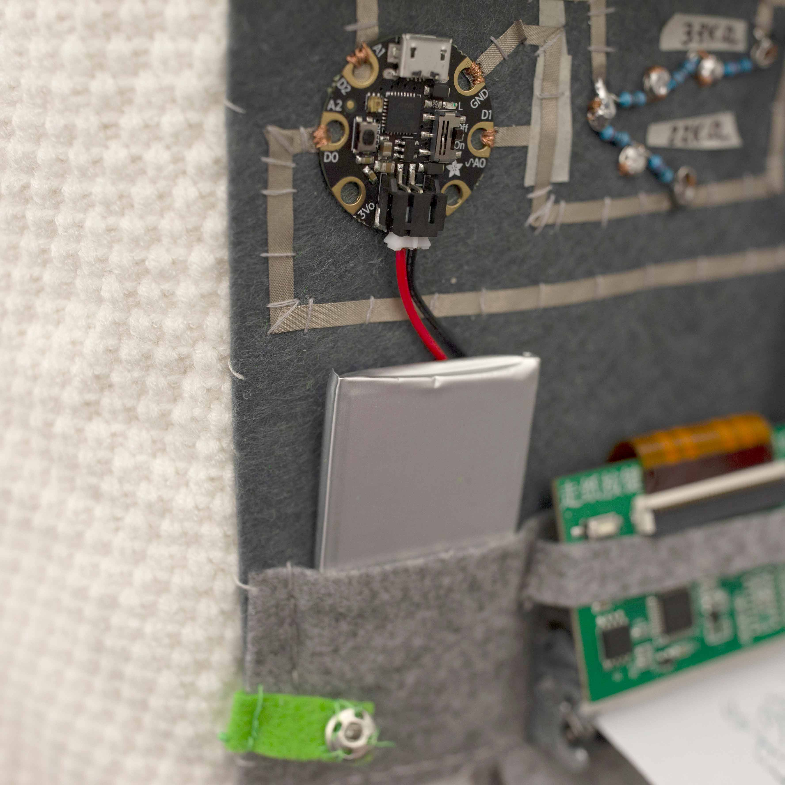

## 1. Co- Individuality

My goal is to answer one question: is technology able to represent what happens in the liminal space of communication across a border. 

This liminal space is where everything is possible: what cannot be real in the current political situation can be real in this space. My answer is creating a shared identity through a telematics experience, connecting two instances of the same OpenFrameworks application using TCP protocol.

_OpenFrameworks_

_TCP_ 

https://www.carlamolins.com/co-individuality

https://github.com/Lywa/CodeSamples/tree/master/Co-individuality

## 2. Galaxy Beta Maker

Galaxy Beta Maker is an interactive experience that brings an opportunity to control temporarily a procedurally generated galaxy. As well as having visible matter (5% of existing matter), the piece provides a chance to experiment with dark matter (25%) and see the consequences towards visible matter of changing the quantity of this invisible and mysterious element.

_Unity_

_Leap Motion_

https://www.carlamolins.com/galaxy-beta-maker

https://github.com/Lywa/CodeSamples/tree/master/Galaxy%20Beta%20Maker/Hello%20Unity

## 3. Merry Grinchmas

The Merry Grinchmas sweater is an interactive garment that provides a wide range of personalized printed messages as a complain whenever someone touches the Grinch's hat pompon. The system will then print in real time one signed message.

_Gemma M0_

_Capacitive Sensing_

_Thermal Printer_

_Soft Circuit_

https://www.carlamolins.com/merry-grinchmas

https://github.com/Lywa/CodeSamples/tree/master/printer_capacitive_GEMMAM0_final

## 4. Blinking Memory

Blinking Memory is a physical game based on the concept of the traditional memory game that has pairs of figures that the user needs to find by flipping two cards every time, and flipping them back if the guess is wrong.

_Build with Arduino_

https://www.carlamolins.com/blinking-memory

https://github.com/Lywa/CodeSamples/tree/master/memory_8

## 5. Tap Box 2.0

Tap box 2.0 is a haptic box system that translates a tactile musical interaction into a visual pattern resultant of the sequence generated.

Tap box 2.0 shapes a personal exploration about the connection between Computational Generated Images (P5.js) and Haptic Interfaces (Arduino + capacitive sensing) with one core shared element, sound. Therefore, the goal is to create a physical musical interface that creates both sounds and computer-generated visuals.

_Arduino_

_p5.js_

https://www.carlamolins.com/tap-box

https://github.com/Lywa/CodeSamples/tree/master/tapbox

## Bonus track

My current WIP project is a mechanical kinetic installation to create the expansion/ contraction of a galaxy when dark matter is removed. 

_Arduino_ 

_PWM driver_

_Nema 17 Stepper Motor_

_Processing_

_Kinect_

https://drive.google.com/open?id=1PBfIPS3IN-rWNEiICT6fvtD55Bz5SRk6

## Enlightening Dark Matter

https://www.carlamolins.com/enlightening-dark-matter

“Enlightening Dark Matter” is a physical computing-powered interactive dome. The dome is suspended from the ceiling hanging from a sturdy parachute thread providing a 360 view of the experience. The system is triggered by introducing the head inside the lower aperture where a set of photocell detects the presence of an alien body which starts distorting the geometric mesh.

## Generative p5.js sketches

https://www.carlamolins.com/computational-form-sketches

 
